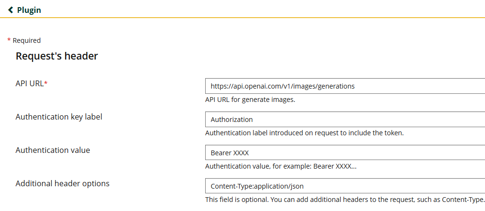
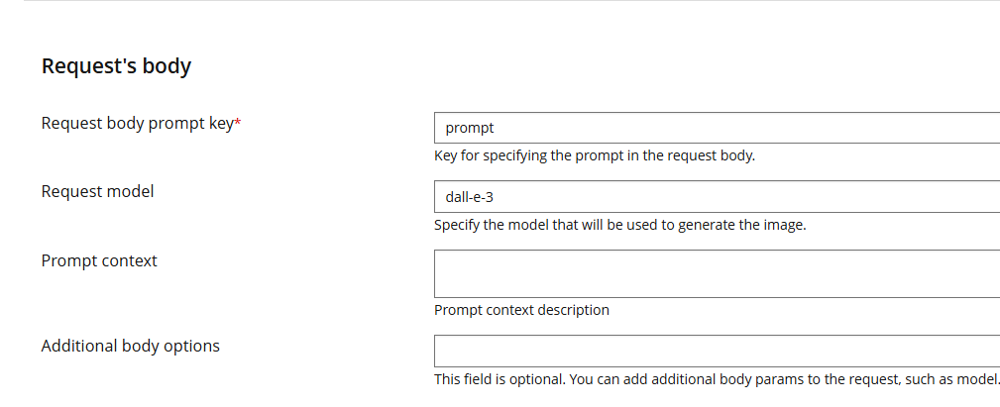
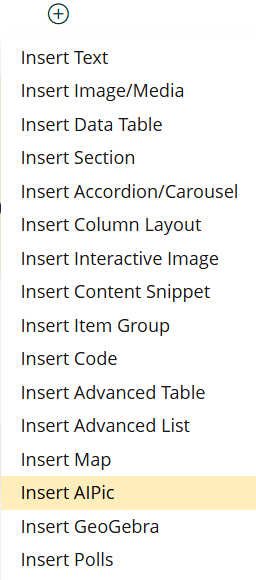
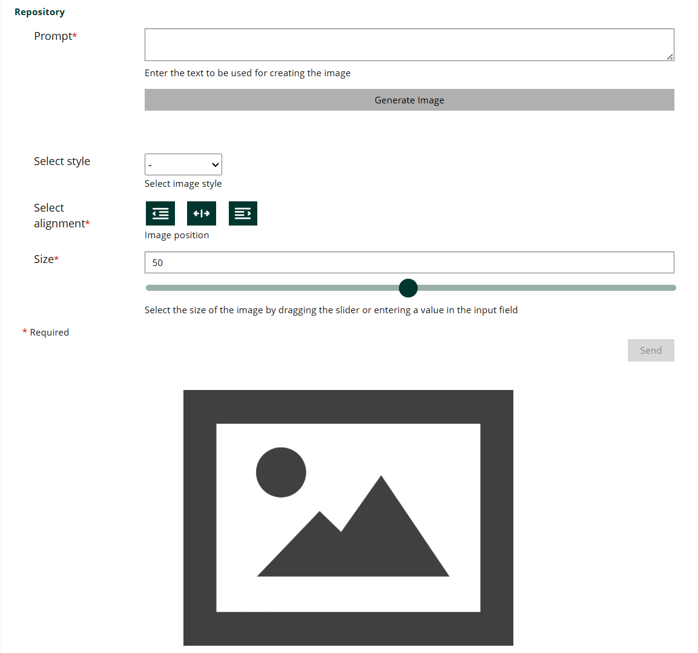
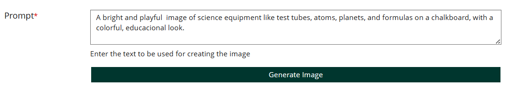
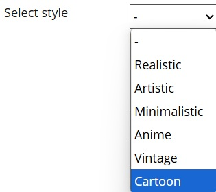
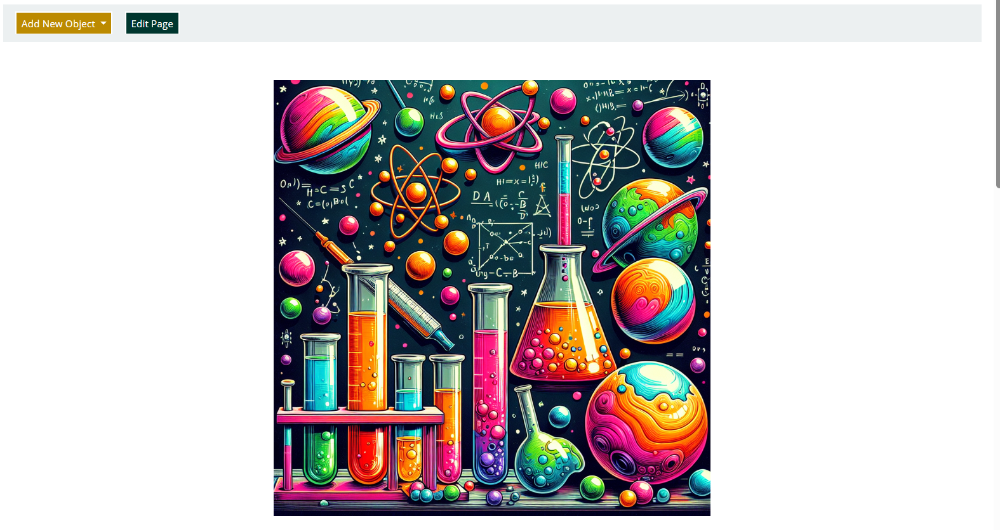

<div style="text-align: center; transform: scale(.5);">
  <picture>
    <source media="(prefers-color-scheme: dark)" srcset="https://github.com/abrahammordev/AIPic/blob/main/templates/images/AIPicBanner.png?raw=true" />
    
  </picture>
</div>

# AIPic Page Component Plugin for ILIAS

Welcome to the official repository for the AIPic Page Component Plugin for ILIAS.
This Open Source ILIAS Plugin is created and maintained by [SURLABS](https://www.surlabs.com).

## What is AIPic for ILIAS?

AIPic is a Page Component plugin that enhances ILIAS pages by allowing users to create images using artificial intelligence directly within the learning environment.

## Features

- Seamless integration of AI image generation within ILIAS pages as a Page Component.
- Generation of images based on user-provided text prompts.
- Options to customize image style, alignment, and size.
- Secure and efficient handling of the image generation process via API.
- User-friendly interface for interacting with the AI image generation tool.

### Software Requirements

- This plugin requires [PHP](https://php.net) version 8.1+ to work properly on your ILIAS platform.
- This plugin requires [ILIAS](https://www.ilias.de/docu/goto.php?target=latest_7&client_id=docu) version 9.x.

### Installation Steps

1.  Create necessary subdirectories if they do not exist:
    ```bash
    mkdir -p Customizing/global/plugins/Services/COPage/PageComponent
    cd Customizing/global/plugins/Services/COPage/PageComponent
    ```
2.  Clone the repository into a directory named `AIPic`:
    ```bash
    git clone https://github.com/surlabs/AIPic.git ./AIPic
    cd AIPic
    git checkout main
    ```
3.  After installation or updating the plugin, run the following commands in the ILIAS root folder:
    ```bash
    composer install --no-dev
    npm install
    php setup/setup.php update
    ```
    **Important:** Make sure your main `composer.json` and ILIAS `.gitignore` files do **not** exclude plugins. Also, do **not** use the `--no-plugins` flag during ILIAS setup.


4.  Go to the ILIAS Plugin Administration page (Administration -> Plugins).
5.  Find the "AIPic" plugin in the list, click "Actions", and select "Install".
6.  After installation, click Then click "Actions" again and select "Activate".
7.  Configure the plugin as needed (e.g., API keys) by clicking "Actions" and then "Configure".
8.  The plugin is now ready to be used on ILIAS pages.

## Using the Plugin

1. **Install and configure** the AIPic plugin as described in the setup instructions.

2. **Navigate** to the ILIAS page where you want to insert an AI-generated image.

3. **Configure** the plugin by completing the following steps:

    - Add the **Request header**:  
      

    - Add the **Request body**:  
      

    - Complete the remaining configuration:  
      

4. **Enable page editing**, then add the **“AIPic” Page Component** from the available elements.  
   

5. The component will first display an **overview** with all available settings and options.  
   

6. In the component’s settings, enter a **text prompt** describing the image you want to generate.  
   

7. Adjust the available options, such as **image style, size, or alignment**, to your preference.  
   

8. Click the generate button — the plugin will create the image based on your input.  
   

9. Once the image is generated, it will be **automatically displayed** on the page.  
   

## Branching

This plugin follows the same branching rules as the ILIAS project:

- **main** (or **trunk**): Main development branch.
- **release_X.X** (e.g., release_9.0): Stable release branches corresponding to ILIAS versions.
<!-- TODO: Confirm actual branching strategy for AIPic -->

## Uninstalling the Plugin

To uninstall the plugin:

1.  Go to ILIAS Plugin Administration, find "AIPic", click "Actions", and select "Deactivate".
2.  Then, click "Actions" again and select "Uninstall".
3.  Remove the plugin directory from your ILIAS installation:
    ```bash
    rm -rf Customizing/global/plugins/Services/COPage/PageComponent/AIPic
    ```
4.  Run the following commands in the ILIAS root folder:
    ```bash
    composer du
    php setup/setup.php update
    ```

## License

This plugin is licensed under GPLv3. See the LICENSE file for details.

---

**Authors:**

- Initially created by [SURLABS](https://surlabs.com), Spain.
- Maintained by [SURLABS](https://surlabs.com), Spain.